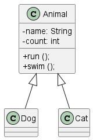

# Домшне завдання 4
### Введення в ООП -> Наслідуваня
***

Структура майбутьного проєкту

Додадкові обмеження:
- біг: кіт 200 м., собака 500 м.; 
- плавання: кіт не вміє плавати, собака 10 м.

Підрахувати скільки ми тварин катували.

***
### Вирішення
1. Строрюємо проект на ПК
2. Commit-имо його
3. Push в віддалений репозиторій
4. Чекаємо на помилки...
5. Створення директорії doc та перенесення документації
6. Додавання медодів для підрахунку Dog та Cat